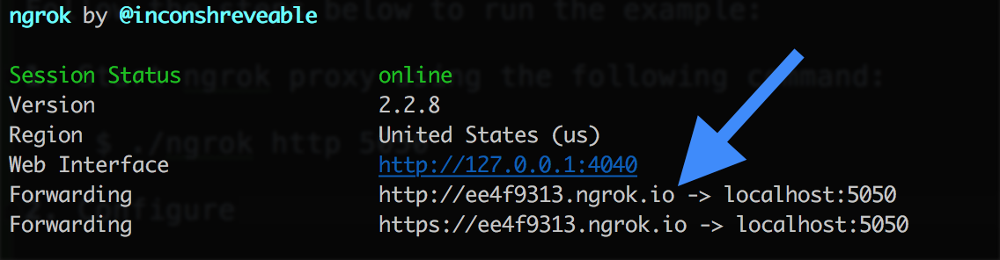

# twilio-webhook-example
An example of sending SMS messages via [Twilio](https://www.twilio.com) and capturing recipient responses via webhook.

This example sends an SMS message to a user asking them to rate their recent purchase experience on a scale of 1 to 10. Their 
response to the SMS message is captured via a service listening for webhook requests from Twilio.

# Prerequisites
This example requires the following:

1. A device or phone number capable of receiving SMS messages.

2. Twilio account and active Twilio phone number. Create them using the [Twilio Console](https://www.twilio.com/console).

3. The sms-webhook service must be exposed to the internet. For local development and testing use [ngrok](https://ngrok.com/) to proxy to your local development environment.

## Running the Example
Follow the steps below to run the example:

1. Start ngrok proxy using the following command:

        $ ./ngrok http 5050
        
    
    
2. Configure the `When a message comes in` webhook destination in your Twilio console under the `Messaging` settings for your Twilio phone number in the following format:

        http://{ngrok url}/webhook
         
3. Start the `sms-webhook` service using the following Gradle command:

        $ ./gradlew :sms-webhook:run
        
4. Run the `sms-client` to send an SMS message to your mobile device using the following Gradle command:

        TWILIO_ACCOUNT_ID={account sid} TWILIO_AUTH_TOKEN={auth token} TWILIO_NUMBER={twilio number} ./gradlew :sms-client:run -Dexec.args={recipient number}
        
    Note: Make sure that the phone number arguments are in the format: `+1##########`
    
5. You will now see that you have received an SMS message on your mobile device asking you to rate your recent purchase experience.

6. Reply with a number 1 through 10 to the SMS message.

7. The webhook service will now be called by Twilio to record your response.

8. Run the following command to verify that your rating was recorded:

        $ curl http://localhost:5050/users/{your number}/ratings
        
    This will return a list of ratings submitted by that phone number:
    
        [
          {
            "timestamp": 1518651139987,
            "rating": 7
          }
        ]

## Bugs and Feedback
For bugs, questions, and discussions please use the [Github Issues](https://github.com/gregwhitaker/twilio-webhook-example/issues).

## License
MIT License

Copyright (c) 2018 Greg Whitaker

Permission is hereby granted, free of charge, to any person obtaining a copy
of this software and associated documentation files (the "Software"), to deal
in the Software without restriction, including without limitation the rights
to use, copy, modify, merge, publish, distribute, sublicense, and/or sell
copies of the Software, and to permit persons to whom the Software is
furnished to do so, subject to the following conditions:

The above copyright notice and this permission notice shall be included in all
copies or substantial portions of the Software.

THE SOFTWARE IS PROVIDED "AS IS", WITHOUT WARRANTY OF ANY KIND, EXPRESS OR
IMPLIED, INCLUDING BUT NOT LIMITED TO THE WARRANTIES OF MERCHANTABILITY,
FITNESS FOR A PARTICULAR PURPOSE AND NONINFRINGEMENT. IN NO EVENT SHALL THE
AUTHORS OR COPYRIGHT HOLDERS BE LIABLE FOR ANY CLAIM, DAMAGES OR OTHER
LIABILITY, WHETHER IN AN ACTION OF CONTRACT, TORT OR OTHERWISE, ARISING FROM,
OUT OF OR IN CONNECTION WITH THE SOFTWARE OR THE USE OR OTHER DEALINGS IN THE
SOFTWARE.